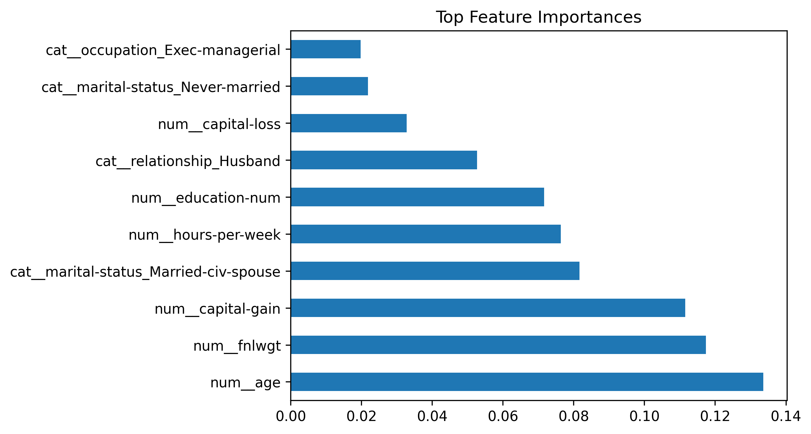
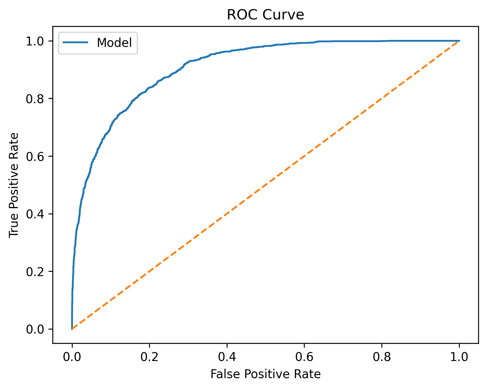
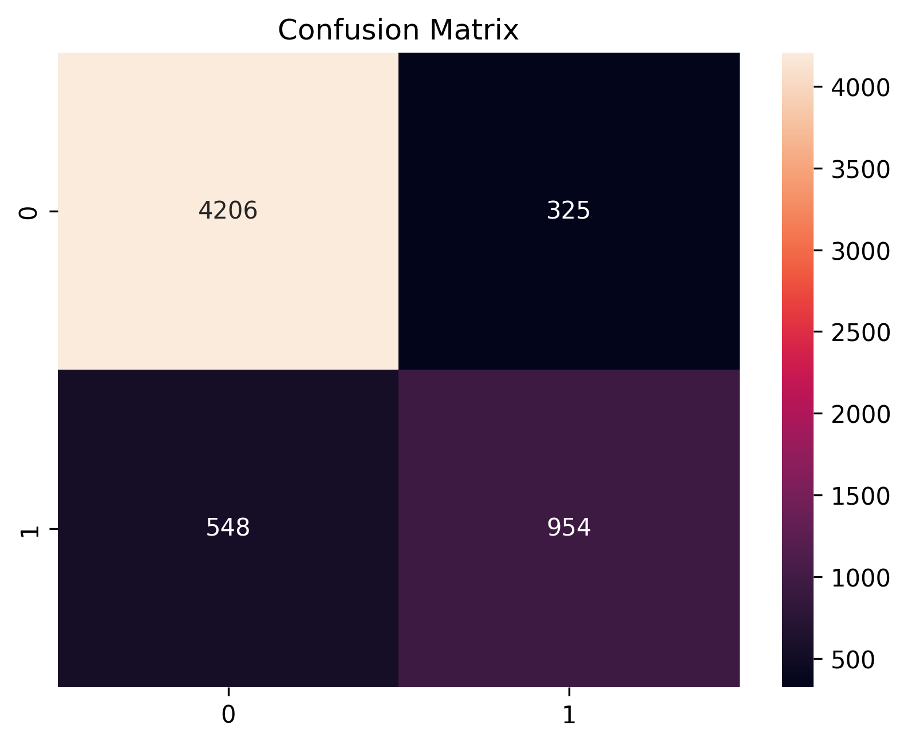

# Adult Income Prediction using Machine Learning with Fairness Analysis

## Overview

This project presents an end-to-end machine learning pipeline for
predicting whether an individual's annual income exceeds **\$50K** using
the **UCI Adult Census Income Dataset**. The workflow covers data
preprocessing, exploratory data analysis (EDA), feature engineering,
model training, hyperparameter tuning, performance evaluation, and
fairness assessment.

The objective is not only to build an accurate classifier, but also to
examine model behaviour from a fairness perspective and compare multiple
machine learning algorithms using common evaluation metrics.

------------------------------------------------------------------------

## Table of Contents

-   Overview
-   Features
-   Dataset
-   Repository Structure
-   Project Workflow
-   Exploratory Data Analysis
-   Models Implemented
-   Model Performance
-   Fairness Analysis
-   Visualizations
-   Installation
-   Usage
-   Project Report
-   Future Improvements
-   References
-   Author

------------------------------------------------------------------------

## Features

-   End-to-end machine learning workflow
-   Comprehensive data preprocessing and cleaning
-   Exploratory Data Analysis (EDA)
-   Feature engineering and preprocessing pipeline
-   Comparison of multiple classification algorithms
-   Hyperparameter tuning for Random Forest
-   Model evaluation using Accuracy, Precision, Recall, F1-score and
    ROC-AUC
-   Fairness evaluation using demographic metrics
-   Feature importance analysis
-   Reproducible notebook with documented workflow

------------------------------------------------------------------------

## Dataset

-   **Dataset:** Adult Census Income Dataset
-   **Source:** UCI Machine Learning Repository
-   **Target Variable:** Income (`<=50K` or `>50K`)

The dataset contains demographic, educational, occupational and
financial information used to predict whether an individual's annual
income exceeds \$50,000.

------------------------------------------------------------------------

## Repository Structure

``` text
adult-income-prediction-fairness/
├── README.md
├── LICENSE
├── .gitignore
├── requirements.txt
├── notebooks/
│   └── adult_income_prediction.ipynb
├── data/
│   ├── adult.csv
│   └── README.md
├── images/
│   ├── age_distribution.png
│   ├── income_distribution.png
│   ├── correlation_heatmap.png
│   ├── education_vs_income.png
│   ├── model_comparison.png
│   ├── confusion_matrix.png
│   ├── roc_curve.png
│   └── feature_importance.png
├── reports/
│   └── project_report.pdf
└── results/
    ├── model_performance.csv
    └── README.md
```

------------------------------------------------------------------------

## Project Workflow

1.  Data Loading
2.  Data Cleaning
3.  Exploratory Data Analysis
4.  Feature Engineering
5.  Data Preprocessing
6.  Train-Test Split
7.  Model Training
8.  Hyperparameter Tuning
9.  Performance Evaluation
10. Fairness Evaluation
11. Feature Importance Analysis

------------------------------------------------------------------------

## Exploratory Data Analysis

The notebook investigates:

-   Income class distribution
-   Age distribution
-   Education level
-   Occupation trends
-   Correlation between numerical features
-   Relationship between education and income

------------------------------------------------------------------------

## Models Implemented

-   Logistic Regression
-   Support Vector Machine (SVM)
-   Random Forest
-   Gradient Boosting
-   XGBoost
-   Tuned Random Forest

------------------------------------------------------------------------

## Model Performance

The project compares multiple supervised learning models using Accuracy,
F1-score and ROC-AUC.

  Model                     Accuracy    F1 Score     ROC-AUC
  --------------------- ------------ ----------- -----------
  XGBoost                 **86.44%**   **0.705**   **0.924**
  Gradient Boosting           85.98%       0.682       0.916
  SVM                         84.98%       0.664       0.898
  Random Forest               84.88%       0.673       0.901
  Logistic Regression         84.75%       0.664       0.902

**Best Performing Model:** XGBoost

------------------------------------------------------------------------

## Fairness Analysis

Beyond predictive performance, the project evaluates fairness to
identify potential disparities across demographic groups. The notebook
includes fairness-oriented metrics and discusses the trade-offs between
model accuracy and equitable predictions.

------------------------------------------------------------------------

## Visualizations

Representative outputs generated during the analysis:

### Model Comparison



### ROC Curve



### Confusion Matrix



### Feature Importance


------------------------------------------------------------------------

## Installation

Clone the repository:

``` bash
git clone https://github.com/Infoman318/adult-income-prediction-fairness.git
cd adult-income-prediction-fairness
```

Install dependencies:

``` bash
pip install -r requirements.txt
```

------------------------------------------------------------------------

## Usage

Open and run the notebook:

``` text
notebooks/adult_income_prediction.ipynb
```

The notebook follows the complete workflow from data loading through
fairness evaluation and model comparison.

------------------------------------------------------------------------

## Project Report

A detailed report describing the methodology, experiments and findings
is available in:

``` text
reports/project_report.pdf
```

------------------------------------------------------------------------

## Future Improvements

-   Model explainability using SHAP
-   Bias mitigation techniques
-   Deep learning approaches
-   Hyperparameter optimization using Bayesian methods
-   Model deployment using Flask or FastAPI
-   Docker containerization
-   CI/CD pipeline for automated testing

------------------------------------------------------------------------

## References

-   UCI Machine Learning Repository -- Adult Census Income Dataset
-   Scikit-learn Documentation
-   XGBoost Documentation
-   Python Data Science ecosystem (NumPy, Pandas, Matplotlib)

------------------------------------------------------------------------

## Author

**Indraneel Verma**

-   GitHub: https://github.com/Infoman318
-   LinkedIn: https://www.linkedin.com/in/indraneel-verma/
